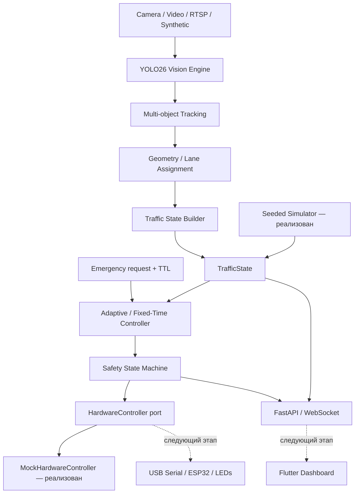
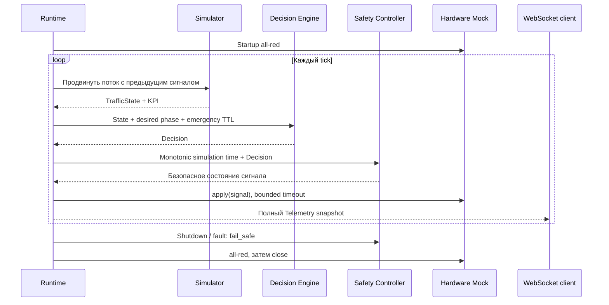

# Smart Traffic AI

Прототип интеллектуального управления перекрёстком: FastAPI backend,
детерминированная simulation, адаптивный и Fixed-Time контроллеры, отдельная
safety state machine, emergency priority, realtime telemetry и сравнение KPI.
Этап 2 добавляет YOLO26 + ByteTrack, webcam/file/RTSP/synthetic sources, геометрию,
очереди и ожидание, калибровку и видео overlay. Камера и ESP32 для demo не нужны.
Flutter UI и физический ESP32 adapter остаются следующими этапами.

## Vision demo

```powershell
uv sync --locked --extra vision
uv run --extra vision python scripts/fetch_vision_demo.py
uv run --extra vision python -m traffic_vision.demo --frames 120
```

Результат: `recordings/vision-demo.mp4`, JPEG-превью, JSONL и JSON-отчёт.
Для realtime backend скопируйте `configs/vision.env.example` в `.env` и запустите:

```powershell
uv run --extra vision uvicorn smart_traffic_backend.main:app --host 127.0.0.1 --port 8000 --workers 1
```

Видео с аналитикой: http://127.0.0.1:8000/api/v1/vision/stream.
Статус: `/api/v1/vision/status`, normalized TrafficState: `/api/v1/vision/state`.
После EOF готовность становится 503 и включается all-red; для повтора перезапустите backend.
Настройка камер, ROI, единицы метрик, режим без модели и устройство потоков —
[docs/VISION_ENGINE.md](docs/VISION_ENGINE.md).

## Запуск

Требования: Python 3.12+ и uv. Команды из корня репозитория:

```powershell
$env:UV_CACHE_DIR = "$PWD\.uv-cache"
uv sync --locked
Copy-Item configs/simulation.env.example .env
uv run uvicorn smart_traffic_backend.main:app --host 127.0.0.1 --port 8000 --workers 1
```

В Linux/macOS: `uv sync --locked`, `cp configs/simulation.env.example .env`, затем
та же команда uvicorn. Кэш можно задать через `export UV_CACHE_DIR="$PWD/.uv-cache"`.

- Swagger: http://127.0.0.1:8000/docs
- Liveness: http://127.0.0.1:8000/health/live
- Readiness: http://127.0.0.1:8000/health/ready
- Snapshot: http://127.0.0.1:8000/api/v1/state
- WebSocket: ws://127.0.0.1:8000/ws/telemetry

```powershell
Invoke-RestMethod http://127.0.0.1:8000/api/v1/state
Invoke-RestMethod -Method Post http://127.0.0.1:8000/api/v1/emergency -ContentType 'application/json' -Body '{"direction":"east","ttl_seconds":30}'
Invoke-RestMethod -Method Delete http://127.0.0.1:8000/api/v1/emergency
uv run python scripts/compare.py --seed 42 --duration 600
```

POST `/api/v1/simulation/compare` принимает `{"duration_seconds":600,"scenario":{"seed":42}}`.
Сценарий можно менять: `north_per_minute`, `south_per_minute`, `east_per_minute`,
`west_per_minute`, `pedestrians_per_minute`. Диапазон benchmark 30–3600 секунд.
Вывод CLI — JSON, который можно сохранить в `recordings/comparison.json`.

Настройки централизованы в Settings и вложенных Timing/Scenario, читаются из `.env`
и переменных `STA_*`; environment имеет приоритет. Пример вложенного параметра:
`STA_SCENARIO__NORTH_PER_MINUTE=25`. `STA_POLICY=fixed` включает Fixed-Time.
Неизвестный mode и некорректные тайминги отвергаются при запуске.
Для control endpoints можно включить `STA_OPERATOR_TOKEN`; тогда передавать
заголовок `X-Operator-Token`. По умолчанию сервер предназначен для localhost.

## Компоненты и структура

```text
apps/
  backend/src/smart_traffic_backend/  config, lifecycle, HTTP/WS, hardware mock
  dashboard/                        контракт будущего Flutter Dashboard
  esp32/                            решение USB Serial и требования к firmware
packages/
  traffic_core/src/traffic_core/     models, policy, safety, ports, timing
  simulator/src/traffic_simulator/   seeded queues, engine, paired benchmark
  vision/src/traffic_vision/         sources, YOLO/ByteTrack, geometry, analytics, overlay, pipeline
configs/                            simulation/vision/calibration env и camera ROI
datasets/                           правила хранения датасетов
recordings/                         локальные видео и результаты
scripts/                            benchmark и проверки
tests/                              unit, integration, deterministic tests
docs/                               архитектура и ограничения модели
docker/                             backend Dockerfile
```

## Архитектура



Vision выдаёт наблюдения и TrafficState. Decision Engine предлагает фазу и
длительность. Только SafetyController формирует сигнал для hardware. Emergency
не обходит минимальный зелёный и защитные интервалы.



Подробности фаз, формулы KPI, допущения и границы слоёв — [docs/architecture.md](docs/architecture.md).
Полный перечень созданных файлов — [docs/files.md](docs/files.md).
Симулятор моделирует количество объектов в FIFO-очередях, а не видеодетекции
или физику перемещения. Улучшение KPI измеряется, но не гарантируется для всех потоков.

## Проверки

```powershell
uv run --locked --extra vision ruff check .
uv run --locked --extra vision ruff format --check .
uv run --locked --extra vision mypy
uv run --locked --extra vision pytest
# Все проверки одной командой в PowerShell:
./scripts/check.ps1
# Если локальная политика блокирует .ps1, только для отдельного процесса:
powershell -NoProfile -ExecutionPolicy Bypass -File scripts/check.ps1
```

Проверяются startup и clearance, пешеходный minimum, emergency TTL, случайные
запросы конфликтующих фаз, fault latch, детерминированность, сохранение числа
объектов, пустой поток, HTTP/WS, авторизация, отказ hardware и graceful shutdown.

Benchmark первого этапа seed 42 / 600 s показал **30.05%** снижения суммарного ожидания.
Vision tests дополнительно проверяют polygon ROI, назначения, queue/wait, lifecycle,
дубли, перегрузку, видеодекодер, EOF, калибровку и ошибки модели.
Этап 2 проверен: **41 тест**, strict mypy и Ruff; настоящий YOLO26 + ByteTrack обработал
два полных ролика — **1024 кадра**. Подробности и ограничения —
[docs/VISION_VERIFICATION.md](docs/VISION_VERIFICATION.md).
Окружение, подробные KPI и ограничения проверки — [docs/verification.md](docs/verification.md).

Docker (опционально): `docker build -f docker/Dockerfile -t smart-traffic-ai .`,
затем `docker run --rm -p 127.0.0.1:8000:8000 smart-traffic-ai`.
И локальная установка, и Dockerfile используют `uv.lock` через `uv sync --locked`.

## Roadmap

1. **Готово:** domain, config, backend, health, simulation, safe control, emergency,
   paired comparison, telemetry, тесты и документация.
2. **Vision реализован:** OpenCV webcam/file/RTSP/synthetic, YOLO26 + ByteTrack,
   полигоны подходов, stop line, stationary detection, identity lifecycle, очереди,
   ожидание, bounded pipeline, overlay и backend calibration.
   Следующая оценка качества: precision/recall, ID switches и ошибка очереди на размеченных роликах.
3. **Flutter:** Material 3 desktop/tablet, схема перекрёстка, realtime графики,
   сравнение KPI, состояние подключения, операторские действия вне widgets.
4. **ESP32:** USB Serial adapter, ACK, heartbeat/watchdog, безопасная прошивка,
   hardware-in-the-loop и независимые проверки запрещённых комбинаций.
5. **Демо:** несколько сценариев и seeds, видео replay, SQLite run history,
   экспорт отчёта, пассажирские KPI, сравнение доверительных интервалов.
6. **Развитие:** PostgreSQL, Wi-Fi/MQTT adapter, визуальный редактор ROI и homography, turning
   movements и расширенная conflict matrix после проверки safety-инвариантов.

Этап предназначен для демонстрационного макета. Тайминги и модель движения
не являются проектом управления реальным дорожным перекрёстком.
