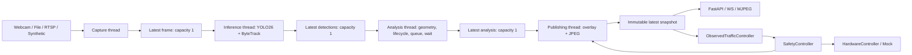
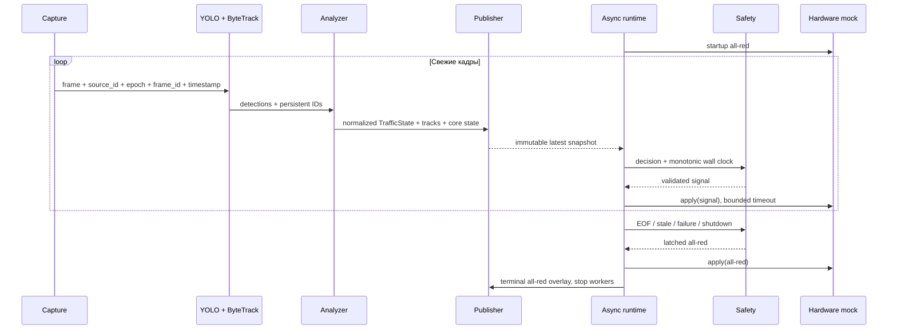

# Vision Engine

Этап 2 добавляет дорожную аналитику к существующим `traffic_core`, simulator и FastAPI.
Vision создаёт наблюдения. `ObservedTrafficController` принимает решения, а прежний
`SafetyController` проверяет переходы и формирует сигнал для `HardwareController`.
В этом этапе hardware остаётся `MockHardwareController`.

## Установка и запуск

Из корня репозитория, Python 3.12+ и uv:

```powershell
uv sync --locked --extra vision
uv run --extra vision python scripts/fetch_vision_demo.py
uv run --extra vision python -m traffic_vision.demo --frames 120
```

Команда создаёт `recordings/vision-demo.mp4`, превью `.jpg`, покадровую аналитику `.jsonl`
и итоговый `.report.json`. По умолчанию окно не открывается. `--show` включает окно OpenCV;
Видео завершается дополнительным кадром all-red; он не входит в число inference frames.
`--frames 0` обрабатывает весь файл, `--stride 2` анализирует каждый второй кадр.
Для своего видео передайте `--input`, `--geometry`, при необходимости `--model` и `--device`.
Не используйте геометрию демонстрационного ролика для другой камеры.
Если GitHub недоступен, загрузите веса через официальный резервный источник:
`uv run --extra vision python scripts/fetch_vision_demo.py --asset model --model-mirror`.
Для минимального набора достаточно `--asset model` и `--asset video`;
`--asset traffic` загружает дополнительный ролик со смешанным движением.

```powershell
Copy-Item configs/vision.env.example .env
uv run --extra vision uvicorn smart_traffic_backend.main:app --host 127.0.0.1 --port 8000 --workers 1
```

Откройте `/api/v1/vision/stream` для MJPEG с overlay и `/docs` для API.
Один worker нужен потому, что состояние камеры, трекера и контроллера принадлежит одному процессу.
Каждому дополнительному источнику в будущем потребуется отдельный экземпляр конвейера.
Служебные настройки Ultralytics сохраняются в `.runtime` (настраивается через
`STA_VISION__RUNTIME_DIRECTORY`). Автоматическая установка пакетов и сетевые проверки
Ultralytics отключены по умолчанию; видеоисточники RTSP продолжают использовать сеть.

Для автономной проверки без модели, камеры и сети:

```powershell
uv run --extra vision python -m traffic_vision.demo --source synthetic --synthetic-detector --frames 150 --output recordings/synthetic-demo.mp4
```

Это явно обозначенный `SYNTHETIC FIXTURE`: детектор цветных тестовых объектов,
предназначенный для проверки аналитики. Настоящее видео всегда проходит через YOLO.
В backend сочетание `STA_MODE=vision`, `STA_VISION__SOURCE=synthetic`,
`STA_VISION__SOURCE_ID=demo`, `STA_VISION__GEOMETRY_PATH=configs/cameras/demo.json`
включает тот же тестовый источник. Старый `STA_MODE=simulation` запускает независимую
детерминированную модель потоков и сравнение Fixed-Time/Adaptive без vision extra.

## Конвейер и владение состоянием



Каждая очередь хранит один элемент и заменяет старый новым. Счётчики пропусков доступны
в статусе. Inference дополнительно отвергает кадр старше `max_frame_age_seconds`.
Захват, модель, аналитика и JPEG не выполняются в ASGI event loop. У каждого WS-клиента
тоже ограниченная очередь. Медленный клиент не задерживает управление.

Видео и synthetic в backend воспроизводятся по исходному времени. Offline demo обрабатывает
выбранные кадры последовательно, сохраняя полноту отчёта; его скорость не ограничена FPS ролика.
Метрика `processing_fps` показывает скорость обработки, а не исходный FPS камеры.



`timestamp` — секунды от начала файла либо монотонного времени live-источника.
`captured_at` — внутренний monotonic timestamp для freshness; он не является UTC.
Контроллер backend использует собственные монотонные часы: скорость inference не сокращает
минимальный зелёный, yellow или all-red. Offline controller использует время replay.

## Детекция и идентичность

`YOLODetector` загружает локальный `yolo26n.pt`, прогревает модель и вызывает
`model.track(source=frame, persist=True, tracker=..., classes=[0,1,2,3,5,7])`.
Это поддерживаемый Ultralytics API для [YOLO26](https://docs.ultralytics.com/models/yolo26/)
и [tracking](https://docs.ultralytics.com/modes/track/). Настройки ByteTrack поставляются
в пакете `bytetrack.yaml`, включая low-confidence association. Модель и трекер принадлежат
только inference worker; обёртка не содержит логики очередей или светофора.

COCO `person` нормализуется в `pedestrian`; остальные классы: `car`, `motorcycle`, `bus`,
`truck`, `bicycle`. Detection содержит confidence, bbox, centroid, timestamp и optional track ID.
Неконфирмированные объекты отображаются как detections, но не увеличивают счётчики прибытий.
Объект привязывается к ROI по нижней центральной точке bbox — приближению контакта с дорогой.

Дубли одного ID внутри кадра объединяются по максимальной confidence. Повторная обработка
того же кадра возвращает прежний snapshot. Occupancy — число видимых треков в текущем кадре;
`unique_arrivals` — число уникальных прибывших ID за сессию, а не сумма occupancy по кадрам.
Неизвестное направление не увеличивает arrival до первого уверенного назначения.

У трека есть first/last seen, ограниченная trajectory, сглаженная скорость, lane,
waiting_started_at, current_wait_time и total_observed_wait_seconds. Потерянный трек не остаётся
в текущей очереди. После TTL он удаляется из live-state, но его ID остаётся в множестве
посчитанных прибытий. Лимит `max_session_tracks` ограничивает память; при достижении лимита
сессия завершается с явной ошибкой, требуя перезапуска, без тихого повторного счёта.

RTSP reconnect увеличивает `stream_epoch`. При смене потока или большом разрыве времени
YOLO adapter сбрасывает ByteTrack через его [reset API](https://docs.ultralytics.com/reference/trackers/byte_tracker/).
Локальные ID оборачиваются монотонными ID; публичный UID включает источник и epoch.
Это не appearance re-identification: длительное перекрытие/смена ID может увеличить arrivals.
Нельзя гарантировать идентичность через reconnect; граница новой сессии видна в телеметрии.

## Геометрия и калибровка

JSON/YAML содержит `source_id`, `reference_width/height`, общую `detection_zone` и четыре
approaches: north, south, east, west. Для каждого: `incoming`, `queue_zone`, `stop_line`,
optional `pedestrian_crossing`, `enabled`, optional `meters_per_pixel`.
Координаты нормализованы: x/W, y/H в диапазоне [0,1]. Это позволяет менять разрешение
с сохранением поля зрения. Изменение кадрирования требует новой калибровки.

Пример отдельного approach (полный документ — `configs/cameras/demo.json`):

```json
{
  "direction": "north",
  "incoming": {"points": [{"x":0.36,"y":0},{"x":0.5,"y":0},{"x":0.5,"y":0.36},{"x":0.36,"y":0.36}]},
  "queue_zone": {"points": [{"x":0.36,"y":0},{"x":0.5,"y":0},{"x":0.5,"y":0.35},{"x":0.36,"y":0.35}]},
  "stop_line": {"start":{"x":0.36,"y":0.35},"end":{"x":0.5,"y":0.35},"upstream":{"x":0.43,"y":0.1}},
  "enabled": true
}
```

`upstream` — точка со стороны приближающегося транспорта. Она определяет, находится ли
объект перед stop line независимо от порядка её концов. Проверка попадания в полигон
использует ray casting с включённой границей, эквивалентно `pointPolygonTest >= 0`.
Выраженно самопересекающиеся, вырожденные полигоны и некорректные линии отвергаются.
Если несколько incoming ROI пересекаются, сохраняется прежняя подходящая lane;
новый неоднозначный объект получает UNKNOWN. Пешеход связывается с pedestrian crossing.

Порядок калибровки:

1. Запустите backend с `STA_MODE=calibration`, источником камеры и её geometry JSON.
   Используйте `configs/calibration.env.example` для первого запуска на synthetic.
2. По кадру выберите detection ROI, incoming/queue polygons и stop line с upstream.
   Для отсутствующих в кадре направлений установите `enabled=false`.
3. PUT `/api/v1/vision/geometry/{source_id}` с полным JSON. При установленном operator token
   нужен заголовок `X-Operator-Token`. GET по тому же URL возвращает сохранённый документ.
4. Перезапустите pipeline с сохранённым geometry_path и `STA_MODE=vision`.

Сохранение атомарное: validation, временный файл, fsync, replace. Имя камеры ограничено
безопасными символами. Изменять геометрию активной камеры в vision mode нельзя (409).
Калибровка держит all-red и отвергает emergency. Визуальный редактор ROI в этот этап не входит.

## Очередь, ожидание и единицы

Транспорт считается queued, если он видим, относится к направлению, находится в queue ROI,
перед stop line и наблюдается медленнее порога N последовательных обработанных кадров.
Скорость оценивается по смещению footpoint в reference pixels за секунду и EMA.
По умолчанию порог 12 px/s, N=3, допустимый интервал наблюдения 0.75 s. При пропусках/разрыве
ожидание не продолжает расти. После движения/выхода из ROI текущий wait обнуляется;
накопленное подтверждённое stopped wait сохраняется отдельно. При подтверждении N кадров
текущий wait включает уже наблюдённый интервал медленного движения.

| Поле направления | Значение |
|---|---|
| car/bus/truck/motorcycle/bicycle/pedestrian_count | Текущие видимые связанные треки |
| queue_count | Подтверждённые queued vehicles |
| estimated_queue_length | Расстояние от stop line до самого дальнего края queued bbox |
| queue_length_unit | `px` в reference resolution либо `m` при заданном масштабе |
| queue_confidence | Средняя detection confidence подтверждённой очереди; 0 для пустой |
| average/max_wait_seconds | Текущее ожидание подтверждённых queued vehicles |
| arrival_rate | Уникальные arrivals транспорта и пешеходов за rolling window, objects/min |
| unique_arrivals | Уникальные arrivals направления с начала source epoch |
| traffic_score / congestion | Веса классов + наблюдаемое ожидание, существующая модель core |

Метрический масштаб — грубая калибровка для небольшой области. Без homography и учёта
перспективы скорость не является км/ч, длина не является точным физическим измерением.
Queue confidence — эвристика, не калиброванная вероятность корректности очереди.
Статистика основана на видимой зоне; полностью скрытые машины не восстанавливаются.

## API и сбои

| Endpoint | Результат |
|---|---|
| `/health/live` | Процесс отвечает |
| `/health/ready` | 200 только при свежем работающем pipeline; иначе 503 |
| `/api/v1/state`, `/ws/telemetry` | VisionTelemetry schema `2.0-vision`: traffic, tracks, signals, decision, pipeline, failure |
| `/api/v1/vision/state` | Только normalized VisionTrafficState |
| `/api/v1/vision/status` | Состояние четырёх стадий, FPS, latency, drops, error |
| `/api/v1/vision/frame.jpg` | Свежий overlay JPEG; stale/EOF → 503 |
| `/api/v1/vision/stream` | MJPEG; при завершении финальный all-red кадр |
| `/api/v1/vision/geometry/{source_id}` | GET/PUT калибровки |

Startup timeout, stale video, ошибка модели/декодера, EOF и остановка приводят к latched
all-red. Автоматического возврата к зелёному после отказа нет — нужен перезапуск.
Readiness при этом 503, liveness остаётся 200. Shutdown закрывает ограниченные очереди,
прерывает ожидания и ждёт worker threads до deadline. RTSP использует FFmpeg open/read
timeouts и ограниченные reconnect attempts. Некоторые webcam/native драйверы не позволяют
прервать зависший вызов: превышение shutdown deadline сообщается как ошибка.
Будущий ESP32 должен самостоятельно контролировать heartbeat: Python не заменяет watchdog.

## Demo footage и проверка качества

Ролик `car-detection.mp4` взят из [Intel IoT sample-videos](https://github.com/intel-iot-devkit/sample-videos),
лицензия CC-BY-4.0; output overlay является обработанной версией этого видео.
`intel-car.json` описывает единственный видимый подход снизу кадра, условно SOUTH;
остальные направления отключены. Stop line в этом коротком фрагменте виртуальная,
задана для проверки геометрии. Уличного светофора и размеченного полного перекрёстка в нём нет.
Дополнительный mixed-traffic ролик загружается через `--asset traffic`.
Для него подготовлен `configs/cameras/intel-mixed.json`: virtual stop line отделяет
нижнюю зону приближения от парковки, pedestrian ROI охватывает видимую область прохода.
Это демонстрационные зоны без утверждения о наличии реального пешеходного перехода:

```powershell
uv run --extra vision python -m traffic_vision.demo --input recordings/person-bicycle-car-detection.mp4 --geometry configs/cameras/intel-mixed.json --frames 0 --output recordings/mixed-demo.mp4
```
Веса — официальный [Ultralytics release v8.4.0](https://github.com/ultralytics/assets/releases/tag/v8.4.0).
Резервный источник — [Ultralytics/YOLO26 на Hugging Face](https://huggingface.co/Ultralytics/YOLO26/blob/main/yolo26n.pt).
Для `yolo26n.pt` проверяется опубликованный SHA-256
`9b09cc8bf347f0fc8a5f7657480587f25db09b34bf33b0652110fb03a8ad4fef` до загрузки модели в память.
Загрузчик сохраняет источник, размер и SHA-256 рядом с активом и проверяет cached файл.
Условия использования модели и пакета — [Ultralytics licensing](https://www.ultralytics.com/license).

Ролик проверяет реальный detector/tracker/overlay. Synthetic проверяет контролируемые
остановки и известные идентичности. Unit tests покрывают геометрию, назначения, очередь,
wait, deduplication, lifecycle; integration tests — decode, bounded queues, failure, HTTP/WS,
calibration и all-red shutdown. Запуск: `uv run --locked --extra vision pytest`,
`uv run --locked --extra vision ruff check .`, `uv run --locked --extra vision mypy`.
Отдельный прогон настоящего YOLO через backend, WebSocket и EOF shutdown:
`uv run --extra vision python scripts/verify_vision_backend.py`.
Он сохраняет `recordings/vision-backend.report.json`, включая latency health-запросов.

Записанное видео не реагирует на выбранный сигнал. Поэтому оно не доказывает сокращение
заторов от управления. Сравнение Fixed-Time/Adaptive остаётся paired simulation benchmark
первого этапа. Оценка detection precision/recall, ID switches и ошибки длины очереди требует
отдельной размеченной выборки; такие показатели здесь не выдумываются.
